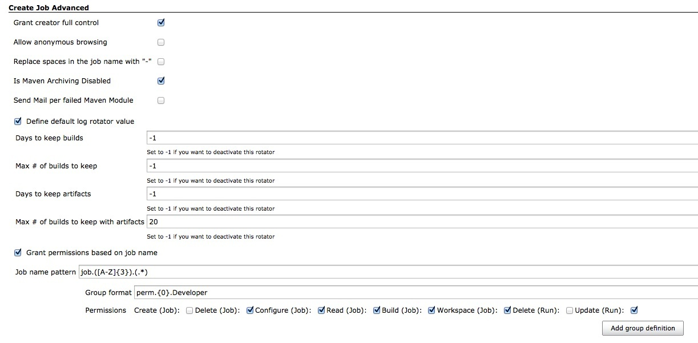

# Create Job Advanced for Jenkins

This plugin extends creating job.  
When you create a job, it automatically adds all permissions for the creator in the [Matrix Authorization Strategy Plugin](https://plugins.jenkins.io/matrix-auth/).

# Release Notes

See [GitHub Releases](https://github.com/jenkinsci/createjobadvanced-plugin/releases/tag/createjobadvanced-1.9.0).
For versions 1.8.0 and older, see [CHANGELOG.md](./CHANGELOG.md).
